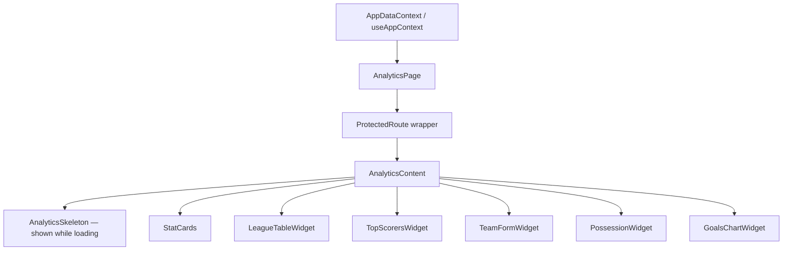
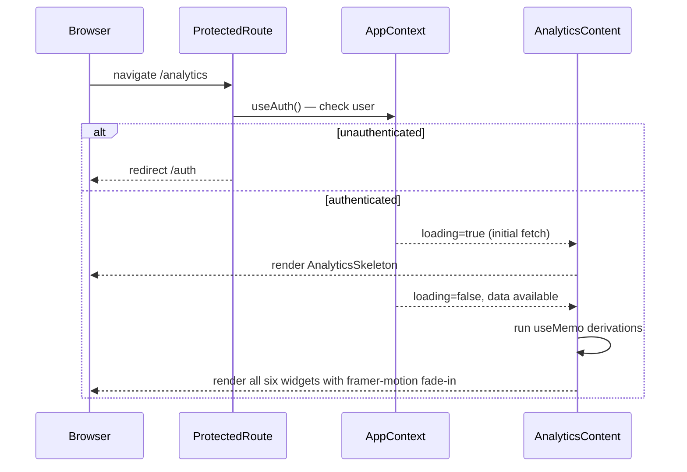

# Design Document: Analytics & Insights Page

## Overview

The Analytics & Insights page (`/analytics`) is a client-side dashboard that derives all of its data from the existing `useAppContext()` hook and renders six widget sections: quick stat cards, a league table, top scorers, team form, possession estimates, and a goals-per-matchday bar chart. No new Firestore subscriptions, API routes, or third-party packages are introduced — everything is computed in `useMemo` hooks inside the page's content component, following the same patterns used by `app/standings/page.tsx` and `app/stats/page.tsx`.

---

## Architecture



All computation happens inside `AnalyticsContent` via `useMemo`. Child widget components are **pure presentation** — they receive fully-derived data via props and own no state.

---

## File Structure

```
app/
  analytics/
    page.tsx           ← AnalyticsPage + AnalyticsContent (main file)

components/
  Sidebar.tsx          ← add Analytics navItem (existing file, one edit)
```

No new component files are strictly required; all widget JSX lives in `app/analytics/page.tsx` as named inner functions. If the file exceeds ~400 lines the widgets can be split into `app/analytics/_components/` but that is an implementation-time decision, not a design constraint.

---

## Data Models

These shapes are derived inside `AnalyticsContent` and passed as props to widgets.

```typescript
// ── Stat card data ──────────────────────────────────────────────────────
interface StatCardData {
  label: string;
  value: number;
  icon: LucideIcon; // Target | TrendingUp | AlertTriangle | Shield
}

// ── Goals per matchday chart ────────────────────────────────────────────
interface MatchdayGoalDatum {
  matchDay: number;  // raw number, e.g. 1, 2, 3
  goals: number;     // sum of homeScore + awayScore for that matchDay
}

// ── Team form ────────────────────────────────────────────────────────────
type FormResult = 'W' | 'D' | 'L';

interface TeamFormEntry {
  teamId: string;
  teamName: string;
  form: FormResult[]; // length 0–5, chronological order
}

// ── Possession estimate ──────────────────────────────────────────────────
interface PossessionEntry {
  teamId: string;
  teamName: string;
  color: string;       // primaryColor or 'hsl(var(--primary))'
  estimate: number;    // whole-number percentage, e.g. 54
}

// ── League table row (already provided by standings, typed here for ref) ─
// standings[] items from useAppContext already have this shape:
// { id, name, logo, color, played, won, drawn, lost, gf, ga, gd, pts }

// ── Top scorer row (already provided by topScorers, typed here for ref) ──
// topScorers[] items from useAppContext already have this shape:
// { player: Player, stats: { goals, assists, yellowCards, redCards, matches } }
```

---

## Components and Interfaces

### `AnalyticsPage` (default export)

```typescript
export default function AnalyticsPage() {
  return (
    <ProtectedRoute>
      <AnalyticsContent />
    </ProtectedRoute>
  );
}
```

Identical pattern to `StandingsPage`. No props.

---

### `AnalyticsContent`

Holds all `useMemo` derivations and orchestrates layout. No props.

```typescript
function AnalyticsContent() {
  const {
    teams, players, matches, goals, assists,
    yellowCards, redCards, standings, topScorers, loading,
  } = useAppContext();

  // all useMemo computations here (see Data Derivation section)
  // ...

  if (loading) return <AnalyticsSkeleton />;

  return (
    <div className="space-y-8 overflow-x-hidden pb-20">
      {/* Header */}
      {/* StatCards row */}
      {/* LeagueTable + TopScorers grid */}
      {/* TeamForm + Possession grid */}
      {/* GoalsChart full-width */}
    </div>
  );
}
```

---

### `AnalyticsSkeleton`

Shown while `loading === true`. No props.

```typescript
function AnalyticsSkeleton() {
  return (
    <div className="space-y-8">
      {/* Header skeleton */}
      <div className="space-y-2">
        <div className="animate-pulse bg-secondary/50 rounded-xl h-10 w-64" />
        <div className="animate-pulse bg-secondary/50 rounded-xl h-5 w-48" />
      </div>
      {/* Stat cards skeleton — 4 cols on md+ */}
      <div className="grid grid-cols-1 md:grid-cols-4 gap-4">
        {Array.from({ length: 4 }).map((_, i) => (
          <div key={i} className="animate-pulse bg-secondary/50 rounded-xl h-28" />
        ))}
      </div>
      {/* 2-col widget row */}
      <div className="grid grid-cols-1 lg:grid-cols-2 gap-6">
        <div className="animate-pulse bg-secondary/50 rounded-xl h-72" />
        <div className="animate-pulse bg-secondary/50 rounded-xl h-72" />
      </div>
      {/* 2-col widget row */}
      <div className="grid grid-cols-1 lg:grid-cols-2 gap-6">
        <div className="animate-pulse bg-secondary/50 rounded-xl h-72" />
        <div className="animate-pulse bg-secondary/50 rounded-xl h-72" />
      </div>
      {/* Full-width chart skeleton */}
      <div className="animate-pulse bg-secondary/50 rounded-xl h-64" />
    </div>
  );
}
```

---

### Widget Components (inner functions)

Each widget is a named function inside the same file. Props are fully typed.

#### `StatCards`

```typescript
interface StatCardsProps {
  cards: StatCardData[];
  animationDelay: number; // 0 — widget index 0
}
```

#### `LeagueTableWidget`

```typescript
interface LeagueTableWidgetProps {
  standings: ReturnType<typeof useAppContext>['standings'];
  animationDelay: number; // 0.1 — widget index 1
}
```

#### `TopScorersWidget`

```typescript
interface TopScorersWidgetProps {
  topScorers: ReturnType<typeof useAppContext>['topScorers'];
  animationDelay: number; // 0.2 — widget index 2
}
```

#### `TeamFormWidget`

```typescript
interface TeamFormWidgetProps {
  formEntries: TeamFormEntry[];
  winPct: number;
  drawPct: number;
  lossPct: number;
  animationDelay: number; // 0.3 — widget index 3
}
```

#### `PossessionWidget`

```typescript
interface PossessionWidgetProps {
  entries: PossessionEntry[];
  animationDelay: number; // 0.4 — widget index 4
}
```

#### `GoalsChartWidget`

```typescript
interface GoalsChartWidgetProps {
  data: MatchdayGoalDatum[];
  animationDelay: number; // 0.5 — widget index 5
}
```

---

## Data Derivation Logic

All derivations live inside `AnalyticsContent` as `useMemo` calls, computed only when their dependencies change.

### Played matches set

```typescript
const playedMatches = useMemo(
  () => matches.filter(m => m.status === 'played'),
  [matches]
);
```

This is the shared base for every derivation below.

---

### Stat Cards

```typescript
const totalGoals = useMemo(
  () => playedMatches.reduce((sum, m) => sum + m.homeScore + m.awayScore, 0),
  [playedMatches]
);

// Only count assist events whose matchId belongs to a played match
const playedMatchIds = useMemo(
  () => new Set(playedMatches.map(m => m.id)),
  [playedMatches]
);

const totalAssists = useMemo(
  () => assists.filter(a => playedMatchIds.has(a.matchId)).length,
  [assists, playedMatchIds]
);

const totalCards = useMemo(
  () =>
    yellowCards.filter(y => playedMatchIds.has(y.matchId)).length +
    redCards.filter(r => playedMatchIds.has(r.matchId)).length,
  [yellowCards, redCards, playedMatchIds]
);

const totalCleanSheets = useMemo(
  () =>
    playedMatches.reduce((sum, m) => {
      let cs = 0;
      if (m.awayScore === 0) cs++; // home team kept a clean sheet
      if (m.homeScore === 0) cs++; // away team kept a clean sheet
      return sum + cs;
    }, 0),
  [playedMatches]
);
```

`StatCardData` array assembled inline:

```typescript
const statCards: StatCardData[] = [
  { label: 'Total Goals',   value: totalGoals,       icon: Target        },
  { label: 'Total Assists', value: totalAssists,     icon: TrendingUp    },
  { label: 'Cards',         value: totalCards,       icon: AlertTriangle },
  { label: 'Clean Sheets',  value: totalCleanSheets, icon: Shield        },
];
```

---

### League Table Widget

No derivation needed — `standings` from `useAppContext` is already sorted and fully computed. Slice to 6 at render time:

```typescript
standings.slice(0, 6)
```

GD display helper (used inline at render):

```typescript
const fmtGd = (gd: number) => gd > 0 ? `+${gd}` : String(gd);
```

Position colour helper:

```typescript
const positionClass = (i: number) => i < 3 ? 'text-primary' : 'text-muted-foreground';
```

---

### Top Scorers Widget

No derivation needed — `topScorers` from `useAppContext` is already sorted descending by goals.

```typescript
// Slice at render time
const displayScorers = topScorers.slice(0, 5);

// Bar width computation (inline at render, not a useMemo — trivial)
const maxGoals = displayScorers[0]?.stats.goals ?? 1;
const barWidth = (goals: number) => `${(goals / maxGoals) * 100}%`;
```

Rank colour mapping:

```typescript
const rankColor = (rank: number): string => {
  if (rank === 1) return '#F5C842';
  if (rank === 2) return '#94A3B8';
  if (rank === 3) return '#CD7F32';
  return ''; // falls through to text-muted-foreground via className
};
```

---

### Team Form Widget

```typescript
const teamFormEntries: TeamFormEntry[] = useMemo(() => {
  return teams
    .map(team => {
      const teamMatches = playedMatches
        .filter(m =>
          (m.homeTeamId === team.id || m.awayTeamId === team.id) &&
          m.homeScore != null &&
          m.awayScore != null
        )
        .sort((a, b) => a.matchDay - b.matchDay || a.id.localeCompare(b.id))
        .slice(-5); // last five

      const form: FormResult[] = teamMatches.map(m => {
        const isHome = m.homeTeamId === team.id;
        const teamScore = isHome ? m.homeScore : m.awayScore;
        const oppScore  = isHome ? m.awayScore : m.homeScore;
        if (teamScore > oppScore) return 'W';
        if (teamScore < oppScore) return 'L';
        return 'D';
      });

      return { teamId: team.id, teamName: team.name, form };
    })
    .filter(entry => entry.form.length > 0)  // only teams with at least 1 result
    .sort((a, b) => a.teamName.localeCompare(b.teamName)); // alphabetical
}, [teams, playedMatches]);

// League-wide percentages
const leagueSummary = useMemo(() => {
  const total = playedMatches.length * 2; // 2 outcomes per match
  if (total === 0) return { winPct: 0, drawPct: 0, lossPct: 0 };
  const draws   = playedMatches.filter(m => m.homeScore === m.awayScore).length * 2;
  const decisive= playedMatches.filter(m => m.homeScore !== m.awayScore).length * 2;
  return {
    winPct:  Math.round((decisive / total) * 100),
    drawPct: Math.round((draws    / total) * 100),
    lossPct: Math.round((decisive / total) * 100), // wins === losses across the league
  };
}, [playedMatches]);
```

> Note: league-wide win % and loss % are always equal because every decisive match produces exactly one winner and one loser. This mirrors the requirement's formula.

---

### Possession Widget

```typescript
const possessionEntries: PossessionEntry[] = useMemo(() => {
  if (standings.length === 0) return [];

  const maxPlayed = Math.max(...standings.map(t => t.played), 0);

  // Build a map of goals scored in team's matches
  const teamMatchGoals = new Map<string, number>();
  teams.forEach(team => {
    const total = playedMatches
      .filter(m => m.homeTeamId === team.id || m.awayTeamId === team.id)
      .reduce((sum, m) => sum + m.homeScore + m.awayScore, 0);
    teamMatchGoals.set(team.id, total);
  });

  // Calculate raw scores
  const rawScores = standings.map(team => {
    const totalGoalsInTeamMatches = teamMatchGoals.get(team.id) ?? 0;
    const gfShare = totalGoalsInTeamMatches === 0
      ? 50
      : (team.gf / totalGoalsInTeamMatches) * 50;
    const playedShare = maxPlayed === 0
      ? 50
      : 50 * (team.played / maxPlayed);
    const raw = gfShare + playedShare;
    return { team, raw };
  });

  const sumRaw = rawScores.reduce((s, r) => s + r.raw, 0);
  const n = standings.length;

  return rawScores
    .map(({ team, raw }) => {
      const estimate = sumRaw === 0
        ? Math.round(100 / n)
        : Math.round((raw / sumRaw) * 50 * n);

      const teamData = teams.find(t => t.id === team.id);
      const color = teamData?.primaryColor || 'hsl(var(--primary))';

      return {
        teamId:   team.id,
        teamName: team.name,
        color,
        estimate,
      };
    })
    .sort((a, b) =>
      b.estimate - a.estimate ||
      a.teamName.localeCompare(b.teamName)
    );
}, [standings, playedMatches, teams]);
```

---

### Goals Per Matchday Chart

```typescript
const goalsPerMatchday: MatchdayGoalDatum[] = useMemo(() => {
  const map = new Map<number, number>();
  playedMatches.forEach(m => {
    map.set(m.matchDay, (map.get(m.matchDay) ?? 0) + m.homeScore + m.awayScore);
  });
  return Array.from(map.entries())
    .map(([matchDay, goals]) => ({ matchDay, goals }))
    .sort((a, b) => a.matchDay - b.matchDay);
}, [playedMatches]);
```

---

## Responsive Layout Grid

```
Root container:  className="space-y-8 overflow-x-hidden pb-20"

Header row:      standard block element, no grid needed

Stat cards:      className="grid grid-cols-1 md:grid-cols-4 gap-4"
                 → 1 col on mobile, 4 cols at 768px+

League + Scorers: className="grid grid-cols-1 lg:grid-cols-2 gap-6"
                 → 1 col on mobile/tablet, 2 cols at 1024px+

Form + Possession: className="grid grid-cols-1 lg:grid-cols-2 gap-6"
                 → 1 col on mobile/tablet, 2 cols at 1024px+

Goals chart:     full-width block (no grid wrapper needed)
```

Each widget card: `className="glass-card rounded-2xl border border-border/50 p-5"` (matching `standings/page.tsx` patterns).

---

## Loading Skeleton Structure

`AnalyticsSkeleton` mirrors the live layout exactly so there is no layout shift on load:

| Section | Skeleton element |
|---|---|
| Header title | `h-10 w-64` |
| Header subtitle | `h-5 w-48` |
| 4 stat cards | `grid grid-cols-1 md:grid-cols-4 gap-4` → 4× `h-28` |
| League table | `h-72` (left col of 2-col grid) |
| Top scorers | `h-72` (right col of 2-col grid) |
| Team form | `h-72` (left col of 2-col grid) |
| Possession | `h-72` (right col of 2-col grid) |
| Goals chart | `h-64` full-width |

All skeleton blocks use `animate-pulse bg-secondary/50 rounded-xl`.

---

## framer-motion Animation Sequencing

Each widget is wrapped in its own `<motion.div>`. The delay is `N * 0.1` seconds where N is the zero-based render order. The stat-cards row counts as index 0 (one motion wrapper for the entire row, not per card).

```typescript
// Widget N=0: stat cards row
<motion.div initial={{ opacity: 0, y: 20 }} animate={{ opacity: 1, y: 0 }}
  transition={{ duration: 0.3, delay: 0 }}>

// Widget N=1: league table
<motion.div initial={{ opacity: 0, y: 20 }} animate={{ opacity: 1, y: 0 }}
  transition={{ duration: 0.3, delay: 0.1 }}>

// Widget N=2: top scorers
<motion.div initial={{ opacity: 0, y: 20 }} animate={{ opacity: 1, y: 0 }}
  transition={{ duration: 0.3, delay: 0.2 }}>

// Widget N=3: team form
<motion.div initial={{ opacity: 0, y: 20 }} animate={{ opacity: 1, y: 0 }}
  transition={{ duration: 0.3, delay: 0.3 }}>

// Widget N=4: possession
<motion.div initial={{ opacity: 0, y: 20 }} animate={{ opacity: 1, y: 0 }}
  transition={{ duration: 0.3, delay: 0.4 }}>

// Widget N=5: goals chart
<motion.div initial={{ opacity: 0, y: 20 }} animate={{ opacity: 1, y: 0 }}
  transition={{ duration: 0.3, delay: 0.5 }}>
```

The page header (`h1` + `p`) reuses the standing page pattern:

```typescript
<motion.div initial={{ opacity: 0, y: -20 }} animate={{ opacity: 1, y: 0 }}>
```

---

## recharts Configuration

### `GoalsChartWidget` full setup

```typescript
import {
  BarChart, Bar, XAxis, YAxis, CartesianGrid,
  Tooltip, ResponsiveContainer,
} from 'recharts';

// Inside the component:
<ResponsiveContainer width="100%" height={240}>
  <BarChart data={data} margin={{ top: 5, right: 10, left: -20, bottom: 5 }}>
    <CartesianGrid
      strokeDasharray="3 3"
      stroke="rgba(255,255,255,0.1)"
      vertical={false}
    />
    <XAxis
      dataKey="matchDay"
      tickFormatter={(v: number) => `MD ${v}`}
      stroke="rgba(255,255,255,0.1)"
      tick={{ fill: 'hsl(var(--muted-foreground))', fontSize: 11 }}
    />
    <YAxis
      stroke="rgba(255,255,255,0.1)"
      tick={{ fill: 'hsl(var(--muted-foreground))', fontSize: 11 }}
      tickFormatter={(v: number) => Number.isInteger(v) ? String(v) : ''}
      allowDecimals={false}
      width={30}
    />
    <Tooltip
      cursor={{ fill: 'rgba(255,255,255,0.05)' }}
      contentStyle={{
        backgroundColor: 'hsl(var(--card))',
        border: '1px solid hsl(var(--border))',
        borderRadius: '0.5rem',
        fontSize: '12px',
      }}
      formatter={(value: number, _name: string, props: any) =>
        [`${value} goals`, `Matchday ${props.payload.matchDay}`]
      }
      labelFormatter={(label: number) => `Matchday ${label}`}
    />
    <Bar
      dataKey="goals"
      fill="hsl(var(--primary))"
      radius={[4, 4, 0, 0]}
    />
  </BarChart>
</ResponsiveContainer>
```

Empty state (no data): render `<p className="text-center py-10 text-muted-foreground text-sm">No match data yet</p>` instead of the chart components.

---

## Sidebar Modification

### Exact diff to `components/Sidebar.tsx`

**Step 1 — Add import** (add `BarChart2` to the existing lucide-react import block):

```diff
 import {
   LayoutDashboard,
   Shield,
   Users,
   ClipboardList,
   Trophy,
   Menu,
   X,
   TrendingUp,
   Settings,
   ShieldAlert,
   User,
   UserCheck,
-  Globe2
+  Globe2,
+  BarChart2
 } from "lucide-react";
```

**Step 2 — Insert navItem** (after the Stats entry, before the Standings entry):

```diff
 const navItems = [
   { path: "/dashboard", label: "Dashboard",  icon: LayoutDashboard },
   { path: "/teams",     label: "Teams",       icon: Shield          },
   { path: "/players",   label: "Players",     icon: Users           },
   { path: "/stats",     label: "Stats",       icon: TrendingUp      },
+  { path: "/analytics", label: "Analytics",   icon: BarChart2       },
   { path: "/standings", label: "Standings",   icon: Trophy          },
   { path: "/matches",   label: "Matches",     icon: ClipboardList   },
   { path: "/",          label: "Public Home", icon: Globe2          },
 ];
```

No other changes to `Sidebar.tsx` are needed. The existing active-link logic already handles the new path:
- Desktop: `isActive ? "bg-primary/15 text-primary glow-green" : ...`
- Mobile: `isActive ? "bg-primary/15 text-primary" : ...`

Both branches apply automatically because the `navItems` array is iterated for both desktop and mobile menus.

---

## Sequence Diagram: Page Load



---

## Error Handling

### Edge Cases by Widget

| Scenario | Widget | Behaviour |
|---|---|---|
| `loading === true` | All | `AnalyticsSkeleton` shown, no widget renders |
| `playedMatches.length === 0` | StatCards | All values display `0` |
| `playedMatches.length === 0` | LeagueTable | "No matches played yet" paragraph |
| `topScorers` empty / all goals=0 | TopScorers | "No goals recorded yet" paragraph |
| `playedMatches.length === 0` | TeamForm | "No matches played yet" paragraph |
| `playedMatches.length === 0` | Possession | disclaimer + "No data available yet" |
| `goalsPerMatchday.length === 0` | GoalsChart | "No match data yet" paragraph (no chart) |
| `standings.length === 0` | LeagueTable | "No matches played yet" paragraph |
| Team has `primaryColor = ""` | Possession bar | falls back to `hsl(var(--primary))` |
| `topScorers[0]?.stats.goals === 0` | TopScorers bar | `maxGoals` defaults to `1` to avoid divide-by-zero |
| `totalGoalsInTeamMatches === 0` | Possession raw score | defaults to `50` |
| `maxPlayedByAnyTeam === 0` | Possession raw score | defaults to `50` |

---

## Testing Strategy

### Unit Testing Approach

Each `useMemo` derivation in `AnalyticsContent` should be extracted into a pure utility function and unit-tested in isolation with fixed input arrays. Key test cases:

- `playedMatches` filter: given a mix of `'played'` and `'upcoming'` matches, only played ones are included.
- `totalCleanSheets`: a 0-0 match contributes 2, a 1-0 match contributes 1, a 1-1 match contributes 0.
- `teamFormEntries`: at most 5 results per team, ordered chronologically, correct `W`/`D`/`L` mapping.
- `possessionEntries`: estimates sum to approximately `50 * n` (within integer rounding), fallback to `50` when total goals or played games are zero.
- `goalsPerMatchday`: output is sorted ascending by `matchDay`.
- `leagueSummary`: `winPct === lossPct` for any set of played matches.

### Property-Based Testing Approach

**Property Test Library**: fast-check

Key properties to exercise with generated inputs:

- For any list of played matches, `totalGoals` equals the sum of `homeScore + awayScore`.
- For any team, `form.length <= 5`.
- For any non-empty standings array, all `possessionEntries[i].estimate >= 0`.
- `barWidth` for every top-scorer entry is in the range `[0, 100]`.

### Integration Testing Approach

Render `AnalyticsContent` inside a test provider that exposes a controlled `AppContext` value. Assert:

- Skeleton renders when `loading === true`; widgets render when `loading === false`.
- Empty-state messages appear when `playedMatches` is empty.
- No runtime error is thrown when `teams`, `matches`, `goals`, `assists`, `yellowCards`, `redCards`, `standings`, and `topScorers` are all empty arrays.

---

## Correctness Properties

The following invariants must hold after derivation and must be covered by implementation review or unit tests:

### Property 1:
**Goals consistency** — `totalGoals === playedMatches.reduce((s, m) => s + m.homeScore + m.awayScore, 0)`. The stat card value must equal the sum of scores across played matches.

**Validates: Requirements 3.2**

### Property 2:
**Clean sheets non-negative** — `totalCleanSheets >= 0` for any input.

**Validates: Requirements 3.5**

### Property 3:
**Clean sheets double-count** — A 0-0 result contributes exactly 2 to `totalCleanSheets`.

**Validates: Requirements 3.5**

### Property 4:
**Possession sums** — `possessionEntries.reduce((s, e) => s + e.estimate, 0)` ≈ `50 * n` (within rounding) when `n > 0`.

**Validates: Requirements 7.2**

### Property 5:
**Top scorers bar width** — For all entries, `barWidth >= 0 && barWidth <= 100`.

**Validates: Requirements 5.3**

### Property 6:
**Form length** — `entry.form.length <= 5` for all `TeamFormEntry`.

**Validates: Requirements 6.2**

### Property 7:
**Matchday goals sorted** — `goalsPerMatchday` is sorted ascending by `matchDay`.

**Validates: Requirements 8.2**

### Property 8:
**League win/loss parity** — `leagueSummary.winPct === leagueSummary.lossPct` always.

**Validates: Requirements 6.5**

### Property 9:
**No direct Firestore calls** — `AnalyticsContent` must not import from `firebase/*` or `lib/firebase`.

**Validates: Requirements 10.4**

### Property 10:
**Animation delays** — Widget at render index `N` has `delay === N * 0.1`.

**Validates: Requirements 11.3**
